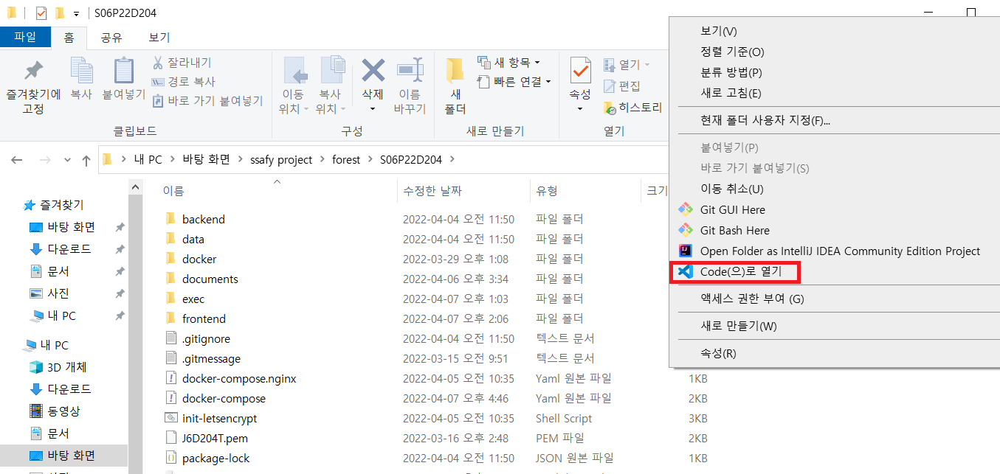
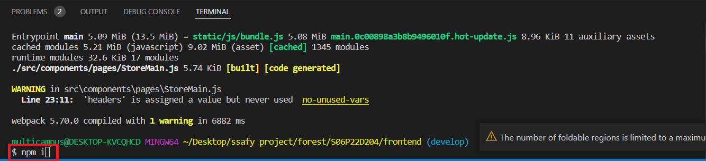
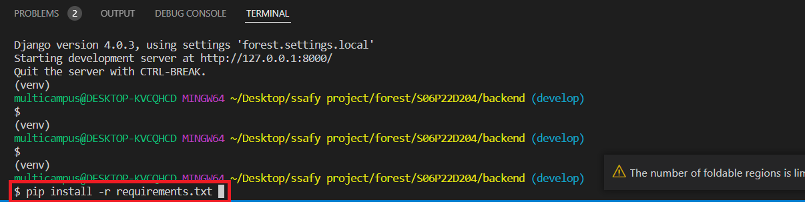
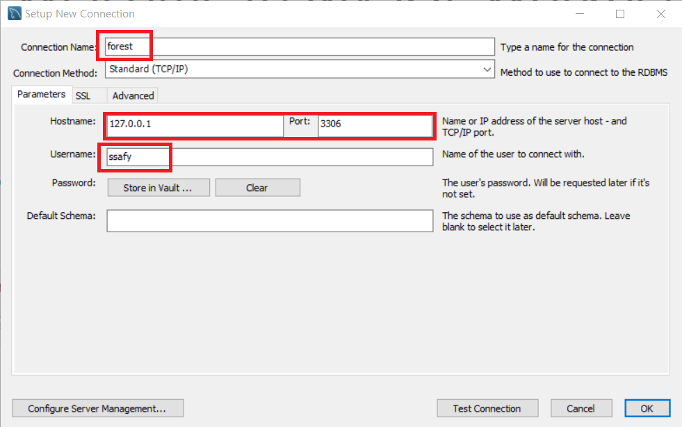
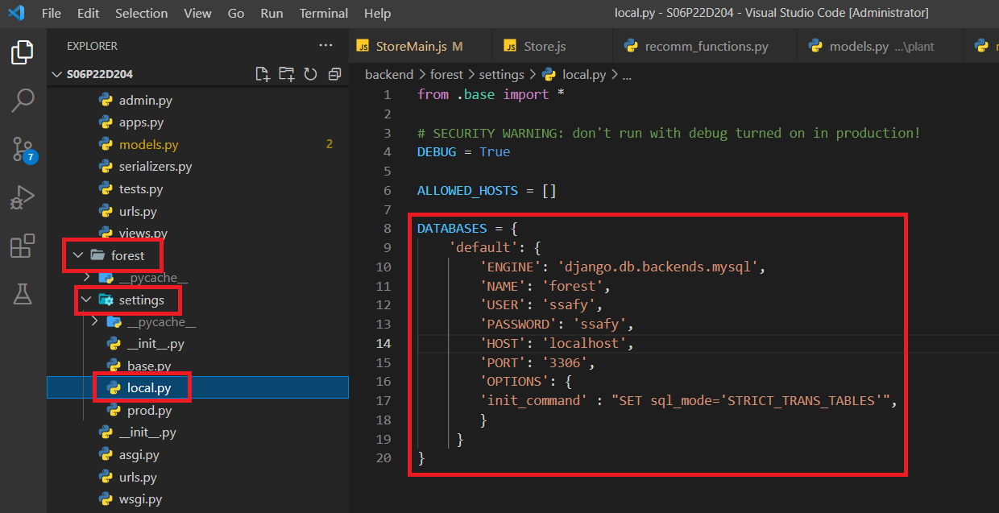
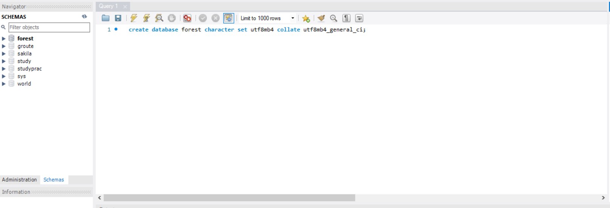

<div align=center> <h1>  Frontend </h1></div>

### 🔧version

Language : Node.js(JavaScript) / v14.18.2

Framework/Library : React.js(Library) / react@17.0.2

IDE : Visual Studio Code


### 🌏라이브러리

```json
"dependencies": {
    "@date-io/moment": "^2.13.1",
    "@emotion/react": "^11.8.2",
    "@emotion/styled": "^11.8.1",
    "@mui/icons-material": "^5.5.0",
    "@mui/lab": "^5.0.0-alpha.76",
    "@mui/material": "^5.5.0",
    "@testing-library/jest-dom": "^5.16.2",
    "@testing-library/react": "^12.1.4",
    "@testing-library/user-event": "^13.5.0",
    "axios": "^0.26.1",
    "bootstrap": "^5.1.3",
    "moment": "^2.29.2",
    "node-sass": "^7.0.1",
    "react": "^17.0.2",
    "react-bootstrap": "^2.2.3",
    "react-calendar": "^3.7.0",
    "react-dom": "^17.0.2",
    "react-native-vector-icons": "^9.1.0",
    "react-responsive-carousel": "^3.2.23",
    "react-router-dom": "^6.2.2",
    "react-scripts": "5.0.0",
    "react-slick": "^0.28.1",
    "react-table": "^7.7.0",
    "react-use-cart": "^1.13.0",
    "recoil": "^0.6.1",
    "sass-loader": "^12.6.0",
    "slick-carousel": "^1.8.1",
    "styled-components": "^5.3.3",
    "web-vitals": "^2.1.4"
  }
```


### 📢실행 방법

#### 1. vscode를 통해 코드를 불러옵니다.




#### 2. 새 터미널 창을 연 후 아래와 같은 코드 순서대로 실행하면 됩니다.



``` 
# 디렉토리 이동
cd frontend

# 라이브러리 설치
npm i

# 실행
npm start
```


<div align=center> <h1>  Backend   </h1></div>

### 🔧version

Language : Python v3.9

Framework : Django

IDE : Visual Studio Code


### 🌏라이브러리

```txt
asgiref==3.5.0
async-generator==1.10
attrs==21.4.0
beautifulsoup4==4.10.0
branca==0.4.2
certifi==2021.10.8
cffi==1.15.0
charset-normalizer==2.0.12
cryptography==36.0.2
cycler==0.11.0
defusedxml==0.7.1
dj-rest-auth==2.2.3
Django==4.0.3
django-allauth==0.49.0
django-cors-headers==3.11.0
django-rest-auth==0.9.5
djangorestframework==3.13.1
djangorestframework-simplejwt==5.1.0
folium==0.12.1.post1
fonttools==4.29.1
gunicorn==20.1.0
h11==0.13.0
haversine==2.5.1
idna==3.3
Jinja2==3.0.3
joblib==1.1.0
kiwisolver==1.3.2
MarkupSafe==2.1.0
matplotlib==3.5.1
mysqlclient==2.1.0
numpy==1.22.2
oauthlib==3.2.0
outcome==1.1.0
packaging==21.3
pandas==1.4.1
Pillow==9.0.1
pycparser==2.21
PyJWT==2.3.0
PyMySQL==1.0.2
pyOpenSSL==22.0.0
pyparsing==3.0.7
PySocks==1.7.1
python-dateutil==2.8.2
python3-openid==3.2.0
pytz==2021.3
requests==2.27.1
requests-oauthlib==1.3.1
scikit-learn==1.0.2
scipy==1.8.0
seaborn==0.11.2
selenium==4.1.3
six==1.16.0
sklearn==0.0
sniffio==1.2.0
sortedcontainers==2.4.0
soupsieve==2.3.1
sqlparse==0.4.2
threadpoolctl==3.1.0
trio==0.20.0
trio-websocket==0.9.2
tzdata==2022.1
urllib3==1.26.8
wsproto==1.1.0

```


### 📢실행방법

#### 1. vscode를 통해 코드를 불러옵니다.


#### 2. 새 터미널 창을 연 후 아래와 같은 코드 순서대로 실행하면 됩니다.



```
# 디렉토리 이동
cd backend

# 라이브러리 설치
pip install -r requirements.txt

# database 생성
1. database 마이그레이션 전에 mysql에서 forest 스키마를 먼저 생성해야 합니다.
아래 Database의 설정부분을 참고하시고 진행하시기 바랍니다.

2. 스키마를 생성하신 후 아래 코드를 실행하시면 됩니다.
python manage.py makemigrations --settings=forest.settings.local

python manage.py migrate --settings=forest.settings.local

# 실행
python manage.py runserver --settings=forest.settings.local
```


<div align=center> <h1>  Database   </h1></div>

### 🔧version

DB : mysql workbench 8.0.25


### 📢설정

#### 1. 새로운 커넥션을 생성합니다. 일부 값들을 backend에 세팅된 값에 맞게 입력합니다.







#### 2. 아래 sql문을 실행해서 forest 스키마를 생성합니다.



```
### 스키마 생성
create database forest character set utf8mb4 collate utf8mb4_general_ci;
```


#### 3. 이후 backend에서 테이블을 생성하면 됩니다.

